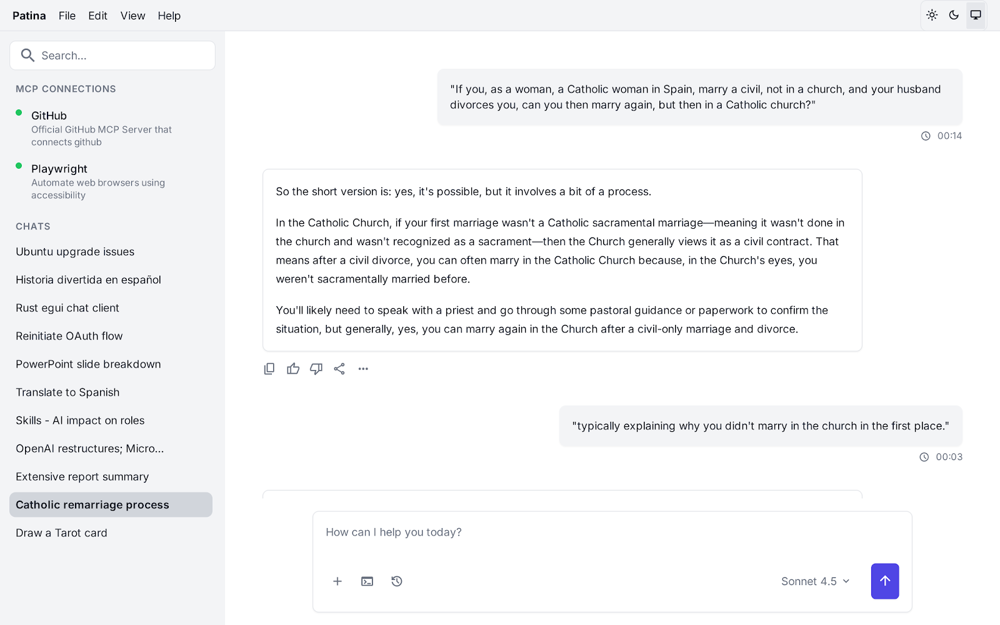
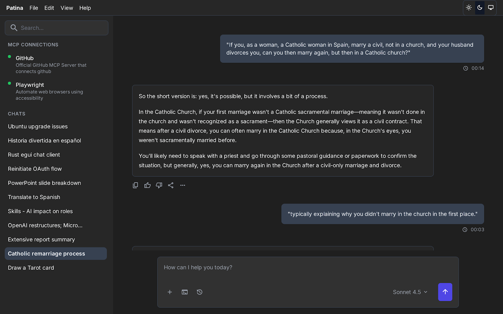

General implementation description in [Previous Agents.md](prompts/2025-11-08-01.AGENTS.md). Do not change these general aspects except when requested in this prompt, below:


Here’s a **complete prompt** you can use for a code-generation agent (e.g., OpenAI’s Codex or Claude Code) to design a **new egui-based UI** for *Patina*, based on the image and your clarified requirements. It’s phrased to generate both code and behavior with flexibility for dark/light/system themes, a collapsible sidebar, and a clean layout.

---

## **Prompt: Build Patina egui Interface (Desktop Chat Client with MCP Sidebar)**

You are an advanced Rust + egui developer. Implement a modern, clean, and modular desktop UI for **Patina**, an AI chat client with MCP integrations. The current UI is not acceptable — rebuild it according to the following detailed functional and aesthetic specification.

---

### **General structure**

* Use **egui** (via eframe) for rendering.
* Respect **system theme**: follow light/dark preference automatically, with manual override in the app menu (“Theme: System / Light / Dark”).
* Target resolution: scalable layout, responsive to window resizing (minimum 1024×720).
* Font and color palette must be consistent (no mixed contrast); prefer soft neutrals in dark mode and off-white in light mode.

---

### **Layout overview**

Check screen mockups:

- 


- 


Use a **three-region layout**:

```
┌──────────────────────────────────────────────────────────────┐
│ Menu bar (File, Edit, View, Help, Theme selector checkbox)   │
├──────────────────────────────────────────────────────────────┤
│ Left sidebar (collapsible)   │   Chat area (central panel)   │
│                              │                               │
│                              │                               │
└───────────────────────────────┴───────────────────────────────┘
```

#### **Top menu bar**

* Traditional menu with items: **File**, **Edit**, **View**, **Help**.
* On the far right: a **Theme selector** (toggle or combo box):

  * System (default)
  * Light
  * Dark

#### **Left sidebar**

* Collapsible panel (can be hidden or resized with a handle).
* Structured vertically in three sections:

  1. **Search box** – single-line text input with a magnifier icon.
  2. **MCP section** – list of configured MCP connectors.

     * Title “MCP” in small bold text.
     * Each MCP has:

       * Name (e.g., “GitHub”, “Playwright”)
       * Subtitle (short description)
       * Status indicator (connected / disconnected dot).
  3. **Chats section** – scrollable list of recent chats.

     * Title “Chats”.
     * Each entry shows:

       * Chat title.
       * Optional date/time or last message snippet.
       * Click → load conversation in main panel.
     * Supports right-click context menu (rename, delete, pin).

Include **visual grouping and small spacing** between sections.
Provide **collapsible subpanels** for MCPs and Chats individually.

---

### **Right (main) chat area**

#### **Chat history**

* Central panel showing the **conversation history** of the active chat.
* Messages alternate left/right alignment:

  * **User messages** (right-aligned, white bubble, compact border, subtle shadow).
  * **AI messages** (left-aligned, darker bubble, adaptive to theme).
* Messages support:

  * Markdown rendering (via `egui_commonmark`).
  * Code fences with syntax highlighting (`syntect` integration).
  * Copy-to-clipboard icon for code blocks.
  * Optional token/latency footer line (small font).
* Chat history must be **scrollable** with smooth inertia.
* Support **lazy loading** for older messages when scrolling up.

#### **Input box**

At the bottom of the chat panel:

* **Multi-line text area** (expandable on Enter).
* On the right side: **Send button** (paper-plane icon).
* Below or to the side: a **toolbar row** with:

  * Model selector dropdown (e.g., `gpt-4o`, `gpt-4.5-turbo`, `custom`).
  * Temperature slider (optional).
  * Tool selector (toggle buttons for “Tools”, “MCPs”, “Files”, etc.).
  * Character count and token estimate indicator (small text on the right).
* Input retains content between sends until cleared manually.

---

### **Color and theme design**

#### **Dark mode (default)**

* Background: `#1E1E1E`
* Sidebar: `#252526`
* Chat user bubbles: `#3A3D41`
* Chat AI bubbles: `#2D2D30`
* Accent (selection, highlights): `#0078D7`
* Text: near-white `#E6E6E6`
* Subtle dividers, shadows, and focus outlines.

#### **Light mode**

* Background: `#FFFFFF`
* Sidebar: `#F3F3F3`
* Chat user bubbles: `#E5E5E5`
* Chat AI bubbles: `#F9F9F9`
* Accent: `#0063B1`
* Text: `#202020`

#### **System mode**

* Follows OS theme dynamically. Use `eframe::NativeOptions::default_theme()` if available.

---

### **Behavior and interactivity**

* Sidebar collapsible via small chevron button.
* Search filters both MCP and chat sections dynamically.
* Clicking MCP → opens settings popover (API key, auth status, reconnect).
* Drag-and-drop ordering of chats.
* Keyboard shortcuts:

  * `Ctrl+K` focus search.
  * `Ctrl+N` new chat.
  * `Ctrl+M` toggle sidebar.
  * `Ctrl+Enter` send message.

---

### **Persistence and state**

* Remember sidebar visibility, selected theme, and window size across restarts.
* Chat history persists per session (stored JSONL).
* Last active conversation reopens automatically.

---

### **Testing & rendering**

* Ensure performance for 1000+ messages.
* Use off-screen rendering for snapshot tests (UI regression).
* All UI components must compile with `--features "egui_commonmark,syntect"` enabled.

---

### **Deliverables**

* Implement `ui.rs` and supporting structs (`Sidebar`, `ChatPanel`, `InputBar`, `MenuBar`).
* Provide a `render_ui(ctx, app_state)` entrypoint in `app/src/app.rs`.
* Include dark/light theme definitions as constants.
* Add snapshot tests under `tests/ui_snapshots/`.
* Follow idiomatic egui layout (panels, top_bottom, side_panel, central_panel).

---

### **Style goals**

* Visually cohesive, minimalistic, and efficient.
* Functional hierarchy: menu > sidebar > chat.
* Adaptive, not flashy. Inspired by VS Code or modern ChatGPT desktop clients.

=