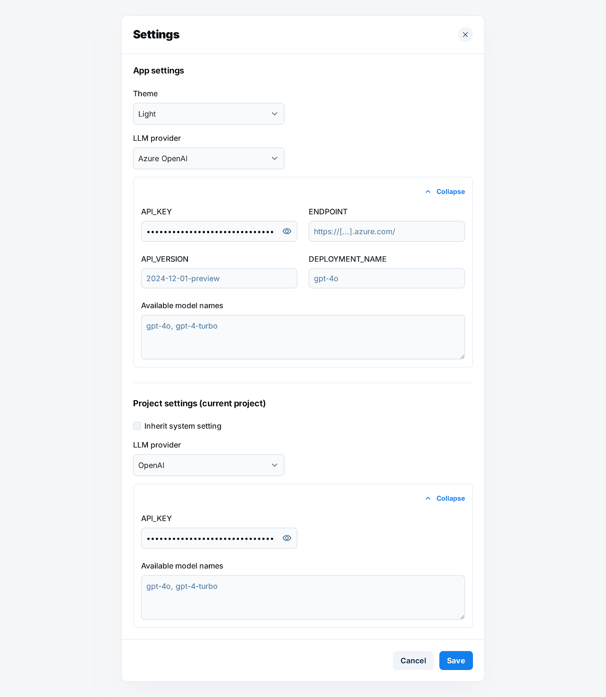

**Prompt for a coding assistant (implement Settings screen for “Patina”, no code included)**

Implement a Settings modal like in the screenshot: a clean two-card layout with a clear separation between “App settings” (global) and “Project settings (current project)”. Each card has its own collapsible provider details panel, inline validation, and Save/Cancel controls. The modal scrolls if needed.

See image at: 

SCOPE

1. Build the UI exactly as shown: labels on the left, inputs on the right, subtle section headers, collapsible provider block with a “Collapse / Expand” affordance.
2. Persist data to YAML files at the default config locations described below, with safe read/write and simple migration if keys are missing.
3. No source code examples in your output. Only implement.

UI REQUIREMENTS

A) App settings (global)
• Theme: dropdown with three options — System, Light, Dark.
• LLM provider: dropdown with two options for now — Azure OpenAI, OpenAI.
• Provider details panel: collapsible.
– Azure OpenAI fields:
• API_KEY: secret input, masked by default; include an eye icon to toggle visibility.
• ENDPOINT: single line text.
• API_VERSION: single line text with placeholder similar to “2024-12-01-preview”.
• DEPLOYMENT_NAME: single line text.
• Available model names: multi-line textarea where the user enters a comma or semicolon separated list. Under the textarea, show the parsed items as selectable chips/tags that will become the choices for model selection elsewhere.
– OpenAI fields:
• API_KEY: secret input with visibility toggle.
• Available model names: same behavior as above.
• Save and Cancel buttons for the App section. Disable Save if validation fails.

B) Project settings (current project)
• Checkbox “Inherit system setting”. When checked, disable all project-level inputs and show a subtle info label “Using App settings”.
• When unchecked, show the same LLM provider dropdown and the corresponding collapsible details panel as in App settings, but only for the chosen provider.
• The Available model names behavior is identical.
• Save and Cancel buttons for the Project section. Saving here writes only the project-level data.

VALIDATION

• API_KEY can be empty in storage, but warn in the UI if the selected provider has no key.
• For Azure OpenAI: ENDPOINT must be a valid URL and API_VERSION must be nonempty to enable Save.
• DEPLOYMENT_NAME is optional but, if present, cannot be only whitespace.
• Available model names: parse by splitting on comma or semicolon, trim whitespace, drop empty entries, deduplicate while preserving order. Display what will be saved.
• If validation fails, show inline error messages next to the fields and keep Save disabled.

PERSISTENCE AND FILE LOCATIONS

Global configuration (applies to all OS, using each OS’s default config root):
• Use the platform’s default user config directory. On Linux, the file lives at:
$HOME/config/patina/patina.yml
• Use equivalent defaults on macOS and Windows based on system conventions for per-user config directories.
• Create intermediate directories if missing.
• The global file contains only App settings.

Project configuration:
• Store project-level settings inside the project’s own path metadata file, located at:
<<project_dir>>/<<project_file>>.path
• Add a dedicated settings section in that .path file to hold the Project settings.
• If “Inherit system setting” is true, do not duplicate provider data in the project file. At runtime, read from the global configuration.

LOAD AND MERGE RULES

• On startup or when opening Settings:

1. Read global configuration from the user config directory.
2. Read project configuration from <<project_dir>>/<<project_file>>.path.
3. If the project is set to inherit, the UI shows global values in disabled state for project fields.
   • On Save in App settings: write only the global file. Preserve unrelated keys if present.
   • On Save in Project settings: write only to the project .path file. Preserve unrelated keys in that file.
   • Include a minimal migration that fills defaults for missing keys and rewrites on Save.

DEFAULT MODEL NAMES:
For both OpenAI as well as Azure OpenAI, use these three model names as default

gpt-5 
gpt-5-mini
gpt-5 nano

UX DETAILS

• Respect the screenshot’s visual hierarchy: two main cards, each with its own collapsible provider block.
• Provide a small helper text under “Available model names” saying “Comma or semicolon separated”.
• After successful Save, show a non-intrusive confirmation.
• Cancel discards local changes.
• The modal should be accessible with keyboard navigation and clear focus states.

ACCEPTANCE CHECKS

• Changing the global theme and provider, saving, then reopening reflects the values from the global file.
• In a project with “Inherit system setting” checked, opening the settings shows project fields disabled and adopting the global values.
• Unchecking inherit, entering OpenAI API key and models at project level, saving, closing, and reopening shows the project overrides and leaves the global file unchanged.
• Entering “gpt-4o; gpt-4-turbo, gpt-4o” in Available model names results in two chips: gpt-4o and gpt-4-turbo, in that order.
• For Azure OpenAI, an invalid endpoint or empty API version keeps Save disabled and shows inline errors.
