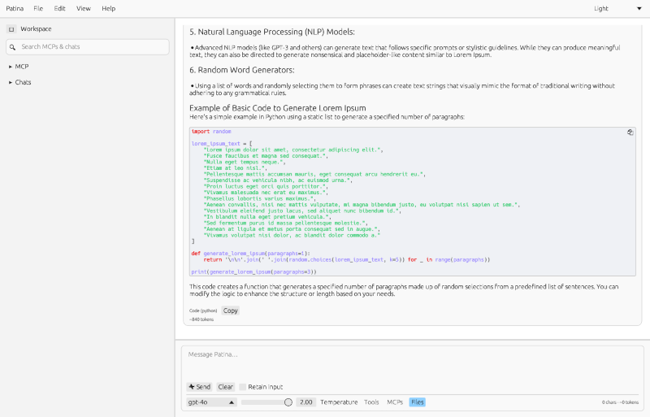
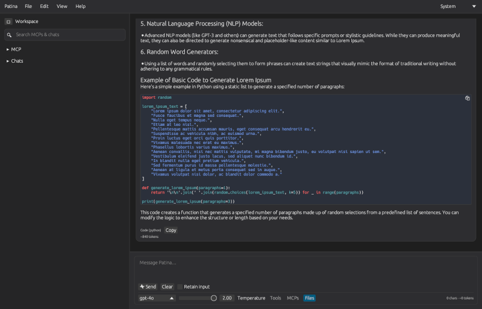

# Patina


Patina is a native desktop chat client built in Rust with an `egui` interface, designed to connect seamlessly with large language models (LLMs) through both cloud and local providers. The current implementation enables direct interaction with OpenAI models, delivering complete replies as they become available as response streaming is still on the roadmap. As with other more advanced capabilities — such as local LLM integration and extended provider support — these are still under active development. The application is evolving quickly toward a full-featured, independent alternative to proprietary AI clients.

Beyond serving as a chat interface, Patina is also conceived as an experimental platform for rapid AI integration and prototyping. Its modular design and support for the Model Context Protocol (MCP) allow developers to attach new agent models or services without altering the core code. This makes it ideal for fast iteration and experimentation, whether testing local LLMs, exploring new AI workflows, or building decoupled agent systems. As the project expands, Patina aims to remain both a practical everyday tool and a flexible testbed for AI-driven desktop innovation.

**Patina Desktop in Light Mode**


**Patina Desktop in Dark Mode**


## Workspace layout

```
patina/
├── app/          # Graphical user interface built with eframe/egui
├── core/         # Shared business logic, state, LLM providers, auth, and MCP
├── tests/        # Unit, integration, and end-to-end style tests
└── xtask/        # Automation helpers (smoke tests, fixtures, CI hooks)
```

Each crate has its own `Cargo.toml` and uses workspace dependencies declared at the root.

## Features

- **Chat experience:** Markdown-rendered conversations with syntax highlighting for code blocks via `egui_commonmark` and `syntect`.
- **LLM provider abstraction:** Unified driver for OpenAI, Azure OpenAI, and a mock provider used by tests. Streaming responses are planned but not yet implemented.
- **Authentication orchestration:** Handles server- and client-managed OAuth modes with persisted secrets ready for reuse.
- **MCP integration scaffolding:** JSON-RPC ready client registry capable of simulating tool invocations and auth handshakes.
- **Persistent history:** Conversations are stored as JSON Lines files and reloaded on startup.
- **Automation:** An `xtask smoke` command exercises the core logic without launching the UI.

## Getting started

### Prerequisites

- Rust 1.76 or newer with `cargo`
- A recent graphics driver capable of running `egui`/`eframe`

Optional environment variables configure LLM providers:

```
LLM_PROVIDER=openai              # or azure_openai, mock
OPENAI_API_KEY=...               # required for OpenAI provider
OPENAI_MODEL=gpt-4o-mini
AZURE_OPENAI_ENDPOINT=https://example.openai.azure.com/
AZURE_OPENAI_API_KEY=...
AZURE_OPENAI_DEPLOYMENT_NAME=gpt-4o
```

### Building and running the desktop app

```
cargo run -p patina
```

The first launch creates a data directory under your platform’s application data folder (for example, `~/Library/Application Support/Patina` on macOS). Conversations persist between sessions.

### Running automated tests

```
cargo test --workspace
```

To execute the smoke test provided by the automation crate:

```
cargo run -p xtask -- smoke
```

### Release binaries

Tagging a commit with `v*` (for example `git tag v0.3.0 && git push --tags`) triggers
`.github/workflows/release.yml`. The workflow builds single-file binaries named `patina`
(`patina.exe` on Windows) with embedded assets for Linux, macOS, and Windows, strips the symbols,
and uploads the artifacts as workflow outputs.

## Project structure in detail

### app crate

Implements the `eframe` application. It renders the conversation list, message view, and composer. Background tasks spawn on a dedicated Tokio runtime and synchronize with the UI using unbounded channels. Streaming UI updates are planned, but the current client displays each response once it has fully completed.

### core crate

Holds the domain logic:

- `state.rs` – application state machine, conversation management, persistence hooks.
- `llm.rs` – provider abstractions for OpenAI, Azure OpenAI, and a mock driver used by tests.
- `mcp.rs` – lightweight MCP client and registry with auth-aware handshake scaffolding.
- `auth.rs` – server/client OAuth coordination that persists refreshed tokens alongside transcripts.
- `store.rs` – JSONL transcript storage and secret persistence.
- `telemetry.rs` – idempotent tracing initialization for binaries and tools.

### tests crate

Hosts unit, integration, and end-to-end tests. The initial suite validates conversation persistence and response generation using the mock LLM driver. Additional tests can be added under `unit/`, `integration/`, and `e2e/`.

### xtask crate

Provides automation entry points. `cargo run -p xtask -- smoke` spins up the core logic with the mock LLM driver and logs the resulting conversation metadata, suitable for CI smoke checks.

## Contributing

1. Fork and clone the repository.
2. Run `cargo fmt` before committing.
3. Add tests for any new functionality in the appropriate crate.
4. Use `cargo run -p xtask -- smoke` to validate end-to-end behavior.


## Principles of Participation

Everyone is invited and welcome to contribute: open issues, propose pull requests, share ideas, or help improve documentation. Participation is open to all, regardless of background or viewpoint.

This project follows the [FOSS Pluralism Manifesto](./FOSS_PLURALISM_MANIFESTO.md), which affirms respect for people, freedom to critique ideas, and space for diverse perspectives. 


## License and Copyright

Copyright (c) 2025, Iwan van der Kleijn

This project is licensed under the MIT License. See the [LICENSE](LICENSE) file for details.
